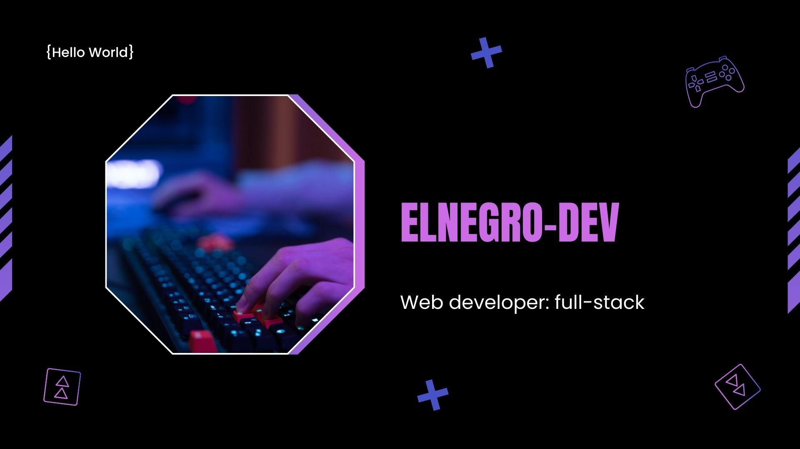

 
 

<h2 align="center">Hola! soy Ulises 👋</h2>

  

 

I enjoy creating accessible websites that convey the most satisfying, effective and visually appealing experience for all users. 

 

Let's open-source together! Send me a link!!!

<h2 align="left">Connect with me:</h2>

 

<h2 align="left">Languages and Tools:</h2>

 

 

 

 
